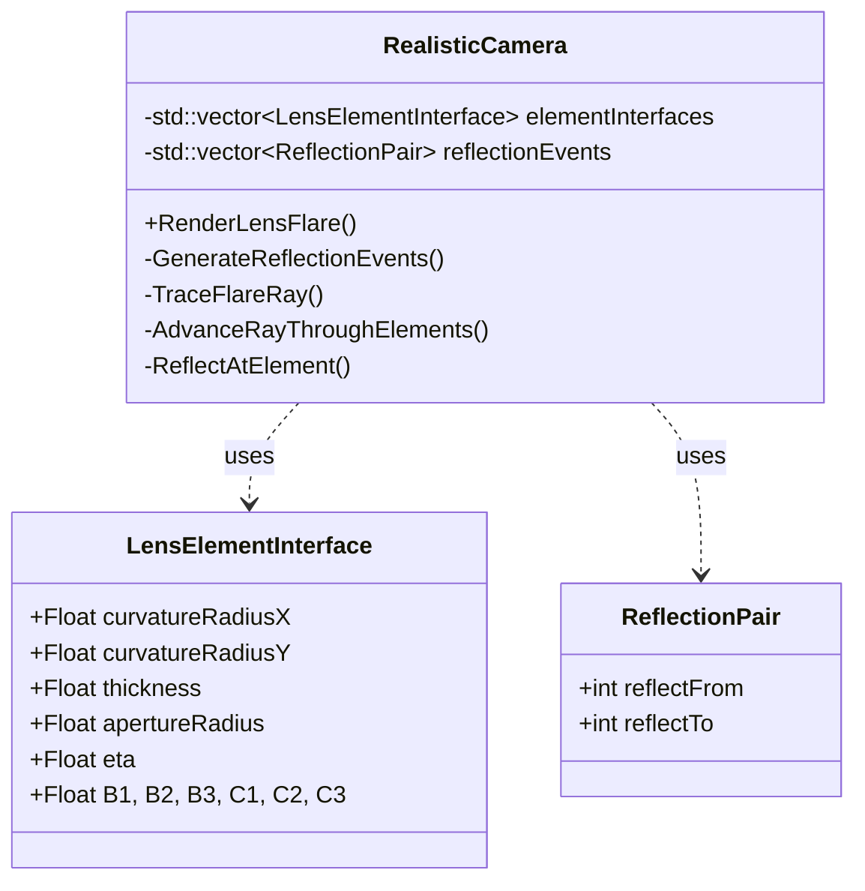
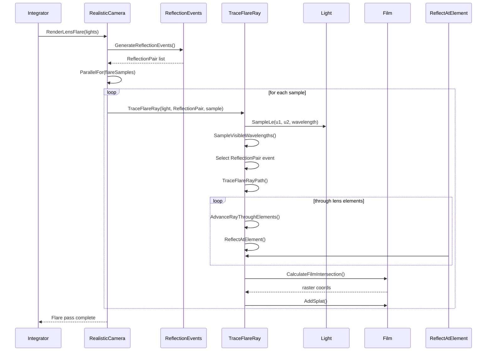

# Technische Raytracer
## Lens Flare Simulation in PBRT v4

---

# Inhaltsverzeichnis

- [Technische Raytracer](#technische-raytracer)
  - [Lens Flare Simulation in PBRT v4](#lens-flare-simulation-in-pbrt-v4)
- [Inhaltsverzeichnis](#inhaltsverzeichnis)
  - [1 Einleitung](#1-einleitung)
    - [1.1 Motivation und Hintergrund](#11-motivation-und-hintergrund)
    - [1.2 Zielsetzung](#12-zielsetzung)
  - [2 Theoretische Grundlagen](#2-theoretische-grundlagen)
  - [3 Vorgehensweise](#3-vorgehensweise)
    - [3.1 Evaluierung von Lösungsansätzen](#31-evaluierung-von-lösungsansätzen)
    - [3.2 Klassen- und Softwarearchitektur](#32-klassen--und-softwarearchitektur)
    - [Ablauf der Lens-Flare-Strahlverfolgung](#ablauf-der-lens-flare-strahlverfolgung)
    - [Sequenzdiagramm](#sequenzdiagramm)
    - [3.3 Szenen- / Versuchsaufbau](#33-szenen---versuchsaufbau)
    - [3.4 Mess- und Bewertungsschema](#34-mess--und-bewertungsschema)
  - [4 Implementierung](#4-implementierung)
    - [4.1 Datenstrukturen](#41-datenstrukturen)
    - [4.2 Kernfunktionen der RealisticCamera](#42-kernfunktionen-der-realisticcamera)
    - [4.3 Integrator-Anbindung](#43-integrator-anbindung)
    - [4.4 Zylinderlinsen und Anamorphie](#44-zylinderlinsen-und-anamorphie)
    - [4.5 Kamera- und Szenenparameter für Lens-Flares](#45-kamera--und-szenenparameter-für-lens-flares)
  - [5 Ergebnisse](#5-ergebnisse)
    - [5.1 Messergebnisse](#51-messergebnisse)
    - [5.2 Auswertung](#52-auswertung)
  - [6 Diskussion](#6-diskussion)
    - [6.1 Interpretation der Ergebnisse](#61-interpretation-der-ergebnisse)
    - [6.2 Fehlerbetrachtung](#62-fehlerbetrachtung)
    - [6.3 Nachteil bei reflektierenden Lichtquellen](#63-nachteil-bei-reflektierenden-lichtquellen)
  - [7. Fazit und Ausblick](#7-fazit-und-ausblick)
  - [8 Literaturverzeichnis](#8-literaturverzeichnis)
  - [9 Abbildungsverzeichnis](#9-abbildungsverzeichnis)
  - [10 Anhang](#10-anhang)
- [I. Eigenständigkeitserklärung](#i-eigenständigkeitserklärung)

---

## 1 Einleitung

### 1.1 Motivation und Hintergrund
In der realen Fotografie und Kinematografie wird das Erscheinungsbild eines Bildes nicht nur durch die Szene selbst, sondern maßgeblich auch durch die Eigenschaften des verwendeten Kamerasystems bestimmt. Insbesondere optische Effekte, die direkt im Objektiv entstehen, tragen wesentlich zur visuellen Charakteristik einer Aufnahme bei.

Lens Flares gehören zu diesen optischen Effekten und entstehen durch Reflexionen an Glas-Luft-Grenzflächen innerhalb eines Objektivs. Ein Teil des einfallenden Lichts wird an den Linsenoberflächen reflektiert, mehrfach im Objektiv umgelenkt und kann schließlich als sogenannte Ghost-Artefakte auf der Bildebene sichtbar werden. Besonders bei sehr hellen Lichtquellen prägen diese Effekte die visuelle Wahrnehmung realer Kameraaufnahmen.

In vielen Rendering-Systemen werden Lens Flares als Post-Processing-Effekt realisiert. Dieser Ansatz ist effizient, berücksichtigt jedoch weder das konkrete Linsendesign noch den Einfluss von Blende, Fokus oder optischen Abbildungsfehlern. Eine Simulation der Effekte direkt im Linsensystem ist daher physikalisch plausibler und besser geeignet, realistische Kameraästhetik zu erzeugen.

Besondere Bedeutung haben dabei anamorphotische Objektive, die zylindrische Linsenelemente mit richtungsabhängiger Krümmung verwenden. Diese führen zu anisotropen Lens Flares, beispielsweise charakteristischen horizontalen Lichtstreifen. Solche Effekte lassen sich mit rein sphärischen Linsenmodellen nicht abbilden und motivieren eine Erweiterung des optischen Modells.

### 1.2 Zielsetzung
Ziel dieser Arbeit ist es, den physikalisch basierten Renderer PBRT v4 so zu erweitern, dass Lens Flares als Folge interner Reflexionen im Linsensystem simuliert werden können. Die Umsetzung soll es ermöglichen, Lens Flares isoliert vor schwarzem Hintergrund darzustellen, um deren Form, Lage und Intensität gezielt zu analysieren.

Dabei werden ausschließlich Lichtpfade mit maximal zwei internen Reflexionen berücksichtigt, da diese den wesentlichen sichtbaren Beitrag zu Lens Flares liefern und gleichzeitig eine praktikable rechnerische Komplexität gewährleisten.

Darüber hinaus ist es Ziel der Arbeit, das Kameramodell konzeptionell auf die Unterstützung von Zylinderlinsen vorzubereiten, um anisotrope und anamorphotische Lens-Flare-Effekte untersuchen zu können.

## 2 Theoretische Grundlagen

Die Simulation von Lens Flares basiert auf grundlegenden Modellen der geometrischen und physikalischen Optik. Beim Übergang von Licht zwischen zwei Medien mit unterschiedlichem Brechungsindex wird der größte Teil des Lichtes gebrochen, während stets ein kleiner Anteil reflektiert wird.

**Fresnel-Gleichungen**   
Der reflektierte Lichtanteil ist vom Einfallswinkel $\theta_i$, dem Transmissionswinkel $\theta_t$ sowie den Brechungsindizes der beteiligten Medien ($n_1, n_2$) abhängig. Für unpolarisiertes Licht berechnet sich der Reflexionsgrad $F_r$ als Mittelwert der s- und p-polarisierten Anteile:

$$
R_s = \left| \frac{n_1 \cos\theta_i - n_2 \cos\theta_t}{n_1 \cos\theta_i + n_2 \cos\theta_t} \right|^2, \quad
R_p = \left| \frac{n_1 \cos\theta_t - n_2 \cos\theta_i}{n_1 \cos\theta_t + n_2 \cos\theta_i} \right|^2
$$

$$
F_r = \frac{R_s + R_p}{2}
$$

**Ghosting und Apertur**    
Lens Flares entstehen hauptsächlich durch mehrfache interne Reflexionen zwischen Linsenoberflächen. Insbesondere Lichtpfade mit zwei Reflexionen tragen wesentlich zu sichtbaren Ghost-Artefakten bei. Reflexionsordnungen höherer Ordnung liefern aufgrund der Potenzierung des Faktors $F_r$ (z.B. $F_r^4 \ll F_r^2$) in der Regel nur einen geringen visuellen Beitrag und werden vernachlässigt.

**Fokus und Astigmatismus**     
Für die Fokusberechnung verwendet PBRT die Thick-Lens-Approximation. Dieses Modell setzt Rotationssymmetrie voraus und ist daher für zylindrische Linsen nur eingeschränkt geeignet. Zylinderlinsen führen zu Astigmatismus, wodurch Licht in horizontaler und vertikaler Richtung unterschiedlich fokussiert wird, was anisotrope Lens-Flare-Strukturen (Streaks) verursacht.

## 3 Vorgehensweise

### 3.1 Evaluierung von Lösungsansätzen

Die Entwicklung der Lens-Flare-Simulation erfolgte iterativ. Dabei wurde zunächst ein naiver stochastischer Ansatz verfolgt, der sich als ineffizient erwies, welcher anschließend durch einen deterministischen, kombinatorischen Ansatz ersetzt wurde.

**Ansatz 1: Stochastisches Raytracing**

Der initiale Lösungsansatz zielte darauf ab, die Flares direkt innerhalb des bestehenden Path-Tracing-Prozesses von PBRT v4 zu generieren. Die Klasse `RealisticCamera` implementiert bereits die Brechung (Refraktion) von Strahlen durch das Linsensystem mittels einer gerichteten `for`-Schleife über die Linsenelemente.
Die Idee bestand darin, diese deterministische Schleife in eine probabilistische `while`-Schleife umzuwandeln. An jeder Linsenoberfläche $i$ sollte basierend auf dem Fresnel-Reflexionsgrad $F_r$ entschieden werden, ob ein Strahl gebrochen oder reflektiert wird.

Hierzu wird eine Zufallsvariable $\xi \in [0, 1)$ gezogen:
*   Wenn $\xi < F_r$: Der Strahl wird reflektiert (Richtungsumkehr im Linsensystem).
*   Wenn $\xi \ge F_r$: Der Strahl wird gebrochen (Standardverhalten).

**Problem:**  
Lens Flares entstehen primär durch Pfade mit zwei internen Reflexionen. Da der Reflexionsgrad $F_r$ an den Linsen sehr gering ist (typischerweise $F_r < 0.04$ oder 4%), ist die Wahrscheinlichkeit $P_{path}$ für einen vollständigen Ghost-Pfad extrem niedrig.

Bei zwei Reflexionen ergibt sich eine Wahrscheinlichkeit im Bereich von $0.04 \cdot 0.04 = 0.0016$ ($0.16\%$).
Ein Monte-Carlo-Integrator benötigt unzählige Samples, um solche seltenen Pfade zu finden. Das Ergebnis war ein Bild, das fast ausschließlich aus Rauschen bestand oder komplett schwarz blieb, da kaum ein Strahl zufällig die korrekte Sequenz (Licht $\to$ Linse $\to$ Reflexion $\to$ Reflexion $\to$ Sensor) fand.

**Ansatz 2: Explizite Kombinatorik (Finaler Ansatz)**   

Um das Rauschproblem zu lösen, wurde das probabilistische Sampling-Problem in ein **kombinatorisches Enumerations-Problem** überführt, basierend auf der Methode von *Hullin et al. (2011)*.
Anstatt darauf zu warten, dass ein Strahl zufällig reflektiert wird, werden alle möglichen Reflexionspaare explizit generiert. Der Algorithmus zwingt den Strahl deterministisch, an zwei spezifischen Flächen zu reflektieren. Dadurch wird garantiert, dass jeder berechnete Strahl zum gewünschten Ghost-Effekt beiträgt, sofern er nicht durch die Apertur blockiert wird.

### 3.2 Klassen- und Softwarearchitektur
Die Implementierung gliedert sich nahtlos in die bestehende Objektstruktur ein. Die Klasse `RealisticCamera` wird um spezifische Methoden zur Flare-Berechnung erweitert.

### Ablauf der Lens-Flare-Strahlverfolgung

1. **Sampling der Lichtquelle**
    - Position und Richtung des Strahls werden über Low-Discrepancy-Sequenzen (`RadicalInverse`) auf der Lichtquelle gesampelt.
    - Wellenlänge(n) des Strahls werden entweder monchromatisch oder als sichtbares Spektrum ausgewählt (`SampleVisibleWavelengths`).
    - Die Lichtintensität wird aus `Light::SampleLe()` entnommen.

2. **Auswahl eines Reflexionspfads**
    - Ein `ReflectionPair` wird aus der Liste aller möglichen Linsenreflexionskombinationen (`reflectionEvents`) ausgewählt.

3. **Sampling des Strahlstarts auf der ersten Linsenfläche**
    - Ein Punkt auf der ersten Linse wird über `SampleUniformDiskConcentric` innerhalb der Apertur ausgewählt.
    - Der Strahl wird vom Lichtpunkt zu diesem Linsenpunkt ausgerichtet.

4. **Strahlverfolgung durch das Linsensystem**
    - Refraktion durch Linsen: `AdvanceRayThroughElements()`
    - Reflexion an einer Fläche: `ReflectAtElement()` (optional mit Sellmeier-Brechungsindex `Sellmeier()`)
    - Strahl wird durch die dazwischenliegenden Linsen **refraktiert**.
    - Reflexion an der zweiten Fläche.
    - Weiter durch die restlichen Linsen **refraktiert** bis zur Filmebene.

5. **Projektion auf den Film und Rasterisierung**
    - Schnittpunkt mit der Filmebene berechnen.
    - Überprüfung, ob der Punkt innerhalb der Filmgrenzen liegt.
    - Umrechnung in Rasterkoordinaten (`physicalExtent.Offset()`).

6. **Akkumulation der Flare-Beiträge**
    - Intensität auf Pixel anwenden (`Film::AddSplat()`).
    - Bei chromatischer Dispersion wird jeder Wellenlängenkanal separat hinzugefügt.
    - Normalisierung durch die Gesamtanzahl der Flare-Samples.

### Sequenzdiagramm

 

### 3.3 Szenen- / Versuchsaufbau
Für die Untersuchung der Lens-Flare-Effekte wurde eine stark vereinfachte, synthetische Szene verwendet. Die Szene wird mit der realisticCamera Klasse gerendert, die ein physikalisch beschriebenes 50mm double gauss Linsenmodell nutzt. Der Blendendurchmesser ist mit 3 mm neutral gewählt, um das Auftreten von Lens-Flares nicht zu behindern und diese dennoch Scharf zu halten.

Als Lichtquelle dient ein extrem helles, diffuses Flächenlicht, das in großer Entfernung zur Kamera positioniert ist und durch eine kleine Kugel näherungsweise punktförmig realisiert wird. Weitere Geometrien oder Lichtquellen sind nicht vorhanden, wodurch ein vollständig schwarzer Hintergrund entsteht.

### 3.4 Mess- und Bewertungsschema

Da sich Lens-Flares als Folge komplexer, mehrfacher interner Reflexionen im Linsensystem nur eingeschränkt analytisch beschreiben lassen, wurde in dieser Arbeit auf eine rein formelbasierte Validierung verzichtet. Stattdessen erfolgte die Bewertung der Ergebnisse primär **qualitativ-visuell** anhand von Referenzbeobachtungen aus der realen Fotografie und bekannten Darstellungen aus der Literatur.

Die erzeugten Lens-Flares wurden hinsichtlich ihrer  
- **räumlichen Lage**,  
- **Form**,
- **spektralen Eigenschaften** (chromatische Aberration, Farbverläufe)  

analysiert und mit typischen Erscheinungsformen realer Objektive verglichen. Dabei zeigte sich, dass die simulierten Effekte in Struktur und Verhalten mit den erwarteten optischen Phänomenen gut übereinstimmen.

Ergänzend wurde versucht, die Resultate mit einer professionellen Optiksimulationssoftware zu vergleichen. Hierzu kam das Programm **Zemax OpticStudio** zum Einsatz. In der verwendeten Version stand jedoch die **Ghost-Tracing** Funktionalität nicht zur Verfügung, sodass ein direkter Vergleich der simulierten Lens-Flares mit einer optischen Referenzsimulation nicht möglich war. 

## 4 Implementierung

### 4.1 Datenstrukturen
Die bestehende Linsenbeschreibung von PBRT bildet die Grundlage der Erweiterung.

*   **LensElementInterface:**
    Diese Struktur repräsentiert eine einzelne Grenzfläche. Sie wurde um `curvatureRadiusX` und `curvatureRadiusY` für anamorphotische Linsen erweitert.
    Zusätzlich speichert die Struktur die **Sellmeier-Koeffizienten** ($B_{1..3}, C_{1..3}$) zur Simulation der chromatischen Aberration (Dispersion). Der wellenlängenabhängige Brechungsindex $\eta(\lambda)$ berechnet sich zur Laufzeit gemäß der Sellmeier-Gleichung:
    
    $$
    n^2(\lambda) = 1 + \sum_{i=1}^{3} \frac{B_i \lambda^2}{\lambda^2 - C_i}
    $$
    
    Wobei $\lambda$ die Wellenlänge in Mikrometern ist.

*   **ReflectionPair:**
    Ein `ReflectionPair` beschreibt ein geordnetes Paar zweier Linsenflächen (`reflectFrom`, `reflectTo`). Diese Paare repräsentieren Reflexionspfade zweiter Ordnung.

### 4.2 Kernfunktionen der RealisticCamera
Die Implementierung der Lens-Flares erfolgt innerhalb der Klasse `RealisticCamera`. 

**Generierung der Reflexionsereignisse**
In der Funktion `GenerateReflectionEvents()` werden alle möglichen Kombinationen von zwei reflektierenden Linsenflächen erzeugt. Gemäß Hullin et al. (2011) berechnet sich die Anzahl $N_{ghosts}$ der möglichen Pfade 2. Ordnung für ein System mit $n$ Elementen wie folgt:

$$
N_{ghosts} = \frac{n(n - 1)}{2}
$$

Hierbei werden Aperturblenden explizit ausgeschlossen, da sie absorbierend wirken ($R_{aperture} = 0$).

**Strahlverfolgung und Physik**
Die zentrale Funktion `TraceFlareRay()` steuert den Prozess.
1.  **AdvanceRayThroughElement():** Propagiert den Strahl mittels Brechung (Snellius) durch ein Element.
2.  **ReflectAtElement():** Führt die Spiegelung durch. Hierbei wird die Intensität $I$ des Strahls mit dem Fresnel-Term $F_r(\theta_i, \eta)$ gewichtet:
    $$ I_{neu} = I_{alt} \cdot F_r(\theta_i, \eta(\lambda)) $$

Trifft der Strahl nach der Sequenz *Licht $\to$ Brechung $\to$ Reflexion 1 $\to$ Reflexion 2 $\to$ Brechung $\to$ Film* auf den Sensor, wird sein Beitrag normalisiert und als Splat akkumuliert.

### 4.3 Integrator-Anbindung
Die Lichtquellen werden nicht innerhalb der Kamera definiert, sondern vom Integrator als Vektor aller aktiven Szenenlichter bereitgestellt. Dieser Vektor wird an den Lens-Flare-Pass der Kamera übergeben und dient dort ausschließlich als Ausgangspunkt für das Sampling von Emissionsstrahlen zur Simulation interner Reflexionen im Linsensystem.

Der bestehende Integrator von PBRT wurde hierfür um einen zusätzlichen Verarbeitungsschritt nach dem regulären Rendering erweitert. Nach Abschluss der Bildberechnung wird geprüft, ob die verwendete Kamera eine RealisticCamera ist. In diesem Fall wird die Funktion `RenderLensFlare()` aufgerufen, welche die Lens-Flare-Beiträge berechnet und additiv auf dem Film akkumuliert. Der eigentliche Integrationsalgorithmus zur Berechnung der globalen Beleuchtung bleibt dabei unverändert.

### 4.4 Zylinderlinsen und Anamorphie
Zylindrische beziehungsweise anamorphotische Linsen unterscheiden sich von sphärischen Linsen durch eine richtungsabhängige Krümmung und besitzen daher keine Rotationssymmetrie. Während sphärische Linsen durch identische Krümmungsradien in allen Richtungen beschrieben werden können, gilt für zylindrische Linsen $R_x \neq R_y$. Diese Anisotropie hat sowohl geometrische als auch abbildungstechnische Konsequenzen.

Für eine korrekte Unterstützung zylindrischer Linsen sind zwei Aspekte entscheidend:

1.  **Intersection und Normalenberechnung:** Die Schnittberechnung mit zylindrischen Linsenflächen unterscheidet sich von der sphärischen Variante, da die Krümmung nur in einer Achse berücksichtigt wird. Entsprechend muss auch die Berechnung der Oberflächennormale $\vec{n}$ an die anisotrope Geometrie angepasst werden. Eine korrekte Normalenberechnung ist dabei essenziell, da bereits geringe Abweichungen zu fehlerhaften Brechungs- oder Reflexionsrichtungen führen und Strahlen das Linsensystem frühzeitig verlassen können.

2.  **Fokusberechnung:** Ein zentrales Problem bei der Integration zylindrischer Linsen ist die Fokusberechnung. Durch den auftretenden Astigmatismus existiert kein singulärer Fokuspunkt, an dem beide Raumrichtungen gleichzeitig scharf abgebildet werden. Das in PBRT verwendete Fokusmodell basiert auf einer Thick-Lens-Approximation, die das gesamte Linsensystem durch eine einzige effektive Brennweite beschreibt und Rotationssymmetrie voraussetzt. Dieses Modell ist daher für zylindrische Linsen nur eingeschränkt anwendbar.
Eine physikalisch korrekte Abbildung würde eine numerische Fokus-Suche erfordern, bei der die Spotgröße auf der Filmebene minimiert wird, beispielsweise über den RMS-Spot-Radius getrennt in horizontaler und vertikaler Richtung oder als kombinierte Optimierung beider Achsen.
 
Zur konzeptionellen Auslegung der zylindrischen Linsenelemente wurde ein reales anamorphotisches Objektivdesign aus der Patentliteratur als Vorlage herangezogen. Dabei diente das europäische Patent EP 3825750 A1 als Referenz, da es einen übersichtlichen anamorphotischen Aufbau beschreibt, bei dem die richtungsabhängige Abbildung primär durch eine klar abgegrenzte Gruppe zylindrischer Linsen erzeugt wird, während nachgelagerte Linsenelemente für die eigentliche Bildabbildung verantwortlich sind.

### 4.5 Kamera- und Szenenparameter für Lens-Flares

Zur Steuerung der Lens-Flare-Simulation wurden zwei zentrale Parameter in die Kamerakonfigurationn der Szene eingeführt.

1. **Anzahl der Flare-Samples**
    - Dieser Parameter legt fest, wie viele Strahlen insgesamt zur Berechnung der Lens-Flares erzeugt werden.
    - Die Samples werden gleichmäßig auf alle Lichtquellen in der Szene verteilt. Dabei erhält jede Lichtquelle eine bestimmte Anzahl lokaler Samples, wodurch eine gleichmäßige Abdeckung der Lichtquelle sowie der relevanten Linsenoberflächen gewährleistet wird.
    - Eine höhere Samplezahl reduziert das Monte-Carlo-Rauschen in den simulierten Flares, erhöht jedoch linear den Rechenaufwand.

2. **Chromatische Dispersion (Sellmeier vs. konstanter Brechungsindex)**
    - Dieser Boolean-Parameter steuert, ob die Berechnung der Brechungsindizes der Linsen wellenlängenabhängig über die Sellmeier-Gleichung erfolgt oder konstant bleibt.
    - Aktiviert man die Sellmeier-Option, wird für jede Wellenlänge des Strahls der spezifische Brechungsindex berechnet. Dies ermöglicht eine realistische Simulation chromatischer Farbverschiebungen in den Ghost-Artefakten.
    - Bei deaktivierter Dispersion wird ein fester Brechungsindex verwendet. Dadurch werden die Berechnungen beschleunigt, es entstehen jedoch keine Farbabweichungen in den Lens-Flares.

## 5 Ergebnisse

### 5.1 Messergebnisse
In den definierten Testszenen treten reproduzierbar Lens-Flares in Form von Ghost-Artefakten auf.

*   **Positionsabhängigkeit:** Bei Lichtquellen nahe des Bildzentrums entstehen symmetrisch angeordnete Ghosts entlang der optischen Achse. Wird die Lichtquelle zum Rand verschoben, verlagern sich die Artefakte und werden durch das Objektivgehäuse beschnitten (Vignettierung).
*   **Apertur-Einfluss:** Die Form der Artefakte entspricht näherungsweise der Projektion der Blendenöffnung. Größere Aperturen führen zu weicheren Artefakten, während kleine Aperturen scharfe Konturen erzeugen.
*   **Qualitätssteigerung:**
    *   *Baseline (Abb. 1):* Überhöhte Intensität und starkes Rauschen.
    *   *Fresnel-Korrektur (Abb. 2):* Realistische Intensitätsabnahme.
    *   *Sampling (Abb. 3):* Konvergenz und Rauschunterdrückung durch erhöhte Samplezahlen.
    *   *Spektrale Korrektur (Abb. 4):* Plausible Farbsäume (chromatische Aberration) ohne falsche Muster.

*Abbildung 1: Baseline | Abbildung 2: Mit Fresnel | Abbildung 3: High Sampling | Abbildung 4: Spektral korrigiert*

### 5.2 Auswertung
Die Qualität skaliert direkt mit der Sampleanzahl (Monte-Carlo-Konvergenz). Die Laufzeit verhält sich linear zur Anzahl der Flare-Samples. Anamorphotische Tests zeigten eine hohe Sensitivität bezüglich der Fokuslage, was die Notwendigkeit robuster Fokusstrategien unterstreicht.

## 6 Diskussion

### 6.1 Interpretation der Ergebnisse
Die implementierte Lösung zeigt, dass die Beschränkung auf Reflexionen zweiter Ordnung einen hervorragenden Kompromiss zwischen visueller Qualität und Rechenaufwand darstellt. Die Ghost-Artefakte decken sich phänomenologisch mit Beobachtungen an realen Objektiven. Die sichtbaren farbigen Ränder (Dispersion) bestätigen die korrekte Implementierung der Sellmeier-Gleichung. Diese Gleichung macht den Brechungsindex wellenlängenabhängig.
Dadurch werden verschiedene Farben unterschiedlich stark gebrochen und reflektiert.
Bei mehrfachen internen Reflexionen in der Linse (Lens-Flares) laufen Rot, Grün und Blau leicht unterschiedliche Wege, treffen an verschiedenen Positionen und mit unterschiedlicher Intensität auf den Sensor und das erzeugt farbige Flares. Das verbleibende Rauschen in den Flares ist inhärent für Monte-Carlo-Verfahren, bei denen nur ein kleiner Raumwinkel des Lichts tatsächlich den Sensor erreicht ("Small Target Problem").

### 6.2 Fehlerbetrachtung
*   **Sampling-Rauschen:** Trotz hoher Samplezahlen verbleibt hochfrequentes Rauschen in den Randbereichen der Flares. Hier könnten fortgeschrittene Sampling-Methoden (z.B. Metropolis Light Transport) Abhilfe schaffen.
*   **Fehlende Beugung (Diffraktion):** Die aktuelle Implementierung basiert rein auf geometrischer Optik. Wellenoptische Effekte wie der "Starburst" an kleinen Blendenöffnungen werden nicht simuliert, was die Realitätsnähe bei sehr kleinen Blendenzahlen einschränkt.
*   **Beschränkung der Reflexionstiefe:** Durch das Ignorieren von Reflexionen 4. Ordnung und höher könnten subtile Glüh-Effekte (Veiling Glare) fehlen, wenngleich deren energetischer Beitrag gering ist.

### 6.3 Nachteil bei reflektierenden Lichtquellen

Ein Nachteil des aktuellen Verfahrens besteht darin, dass die Lens-Flare-Simulation ausschließlich auf explizitem Light-Sampling basiert. Das bedeutet, dass nur solche Lichtquellen berücksichtigt werden, die im Szenengraph als Lichter definiert sind. Helle Bildbereiche, die durch indirekte Beleuchtung oder starke Reflexionen entstehen, tragen hingegen nicht zur Erzeugung von Flares bei, obwohl sie aus physikalischer Sicht ebenfalls als effektive Lichtquellen wirken.

Das derzeitige Vorgehen entspricht damit funktional einer Form von *Light Tracing* bzw. *Photon Tracing* im Kameraraum: Strahlen werden gezielt von bekannten Lichtquellen durch das Linsensystem propagiert, wodurch Lens Flares ausschließlich dort entstehen, wo die Helligkeit der Szene direkt auf diese Lichtquellen zurückzuführen ist.

Ein vielversprechender theoretischer Ansatz zur Erweiterung dieses Modells ist eine **hybride Sampling-Strategie**, die zwei komplementäre Quellen für Flare-Samples kombiniert:

1. **Explizites Light-Sampling**  
Wie bisher werden Strahlen von definierten Lichtquellen erzeugt und deterministisch durch das Linsensystem verfolgt. Dieser Pfad stellt sicher, dass klassische Lens-Flares, die durch starke Primärlichter verursacht werden, zuverlässig erfasst werden.

2. **Image-space- bzw. Contribution-guided Sampling**  
Zusätzlich werden besonders helle Bildbereiche im bereits gerenderten Bild identifiziert, beispielsweise mithilfe eines Luminanz-Schwellenwerts oder einer bildbasierten Importance-Map. Diese Pixel werden als **sekundäre, effektive Lichtquellen** interpretiert, von denen aus wiederum Strahlen in Richtung Kamera bzw. durch das Linsensystem gesampelt werden.  
Auf diese Weise könnten auch Szenen berücksichtigt werden, in denen die visuell dominierende Helligkeit nicht von einer primären Lichtquelle ausgeht, sondern etwa von **starken Spiegelungen auf Glasflächen**, **polierten Metalloberflächen**, **Wasserflächen** oder **hochglänzenden Bodenmaterialien**.

Die Kombination beider Strategien lässt sich konzeptionell als eine Form von **Multiple Importance Sampling (MIS)** verstehen:  
Ein Teil der Flare-Strahlen wird aus der Verteilung der physikalisch definierten Lichtquellen gezogen, während ein weiterer Teil aus einer bildbasierten Importance-Verteilung stammt, die auf der tatsächlich im Bild auftretenden Helligkeit beruht. Dadurch könnten auch Lens-Flares durch **indirekte Lichtquellen**, **stark gerichtete Sekundärreflexionen** und **spiegelnde Oberflächen** erfasst werden, ohne die Effizienz des Verfahrens für klassische Lichtsituationen wesentlich zu beeinträchtigen.

## 7. Fazit und Ausblick

In dieser Arbeit wurde der Renderer PBRT v4 erfolgreich um eine physikalisch basierte Simulation von Lens Flares erweitert. Durch die Integration der Fresnel-Gleichungen und des Sellmeier-Dispersionsmodells in die `RealisticCamera` konnten realistische Ghost-Artefakte erzeugt werden. Die Ergebnisse validieren, dass die Berücksichtigung von Reflexionen 2. Ordnung für plausible Resultate ausreichend ist.

Die Erweiterung in Richtung zylindrischer beziehungsweise anamorphotischer Linsen erwies sich hingegen als deutlich anspruchsvoller. Obwohl die notwendige Geometrie und Datenstruktur konzeptionell umgesetzt werden konnten, zeigte sich, dass das in PBRT verwendete rotationssymmetrische Fokusmodell für anisotrope Linsensysteme nur eingeschränkt geeignet ist. Eine vollständige und stabile Abbildung anamorphotischer Effekte erfordert daher weiterführende Anpassungen der Fokusberechnung.

**Ausblick:**
Zukünftige Arbeiten könnten sich auf die Simulation wellenoptischer Effekte konzentrieren, um Beugungsmuster an der Blende zu integrieren. Zudem wäre eine Portierung auf die GPU, beispielsweise unter Nutzung der PBRT-v4-GPU-Pipeline, erstrebenswert, um interaktive Anwendungen zu ermöglichen. Für anamorphotische Linsen ist eine Weiterentwicklung der Fokus- und Autofokus-Strategie notwendig, um astigmatische Effekte robuster zu handhaben.

Eine weitere naheliegende Erweiterung ist die Berücksichtigung wellenlängenabhängiger Linsenvergütungen (Coatings). Reale Objektive verwenden Antireflexbeschichtungen, die den Fresnel-Reflexionsgrad abhängig von der Wellenlänge gezielt beeinflussen. Die Integration entsprechender Coating-Modelle würde die Simulation farbiger und materialspezifischer Lens Flares ermöglichen und die visuelle Übereinstimmung mit realen Kameras weiter verbessern.

Darüber hinaus könnten gezielte Importance-Sampling-Strategien für relevante Reflexionspfade sowie eine Validierung anhand realer Referenzaufnahmen die Effizienz und Aussagekraft der Methode weiter erhöhen.

## 8 Literaturverzeichnis
1.  Hullin, M. B., Eisemann, E., Seidel, H.-P., & Lee, S. (2011). Physically-Based Real-Time Lens Flare Rendering. *ACM Transactions on Graphics (SIGGRAPH)*.
2.  Pharr, M., Jakob, W., & Humphreys, G. (2023). *Physically Based Rendering: From Theory to Implementation (v4)*. MIT Press.
3.  Hecht, E. (2016). *Optics* (5th ed.). Pearson.
4.  Guangdong Sirui Optical Co., Ltd., Anamorphic Lens, European Patent EP 3 825 750 A1, veröffentlicht am 26. Mai 2021.
5.  U. Teubner and H. J. Brückner, Optical Imaging and Photography: Introduction to Science and Technology of Optics, Sensors and Systems. Berlin/Boston: De Gruyter, 2019,   Kapitel 6.8. doi: 10.1515/9783110472943.
6.  V. Blahnik and B. Voelker, “About the reduction of reflections for camera lenses: How T*-coating made glass invisible,” Zeiss Lenspire, 2022. [Online]. Verfügbar unter: https://lenspire.zeiss.com/photo/app/uploads/2022/02/technical-article-about-the-reduction-of-reflections-for-camera-lenses.pdf
7.  E. Pekkarinen and M. Balzer, “Physically based lens flare rendering in The Lego Movie 2,” in Proceedings of the 2019 Digital Production Symposium, Los Angeles, CA, USA: ACM, July 2019, pp. 1–3. doi: 10.1145/3329715.3338881.
8.  H. Tang, "Rendering Realistic Lens Flare", Technischer Projektbericht mit PBRT-basierter Implementierung, 2011.

## 9 Abbildungsverzeichnis
*   **Abbildung 1:** Baseline-Ergebnis der Lens-Flare-Simulation (Seite 10)
*   **Abbildung 2:** Lens-Flares mit korrekter Fresnel-Gewichtung (Seite 11)
*   **Abbildung 3:** Reduziertes Rauschen durch High-Sampling (Seite 11)
*   **Abbildung 4:** Finale spektrale Korrektur (Seite 12)

## 10 Anhang

# I. Eigenständigkeitserklärung

Hiermit bestätigen wir, dass die hier vorliegende Arbeit selbstständig verfasst ist und nur die angegebenen Hilfsmittel genutzt wurden. Unter Angabe der Quellen wurde außerdem kenntlich gemacht, welche dem Wortlaut oder Sinn nach anderen Werken entnommen sind.

*   **Marcel Kazemi**, XX.XX.XXXX
*   **Marvin Bernei**, XX.XX.XXXX
*   **Artem Grütter**, XX.XX.XXXX